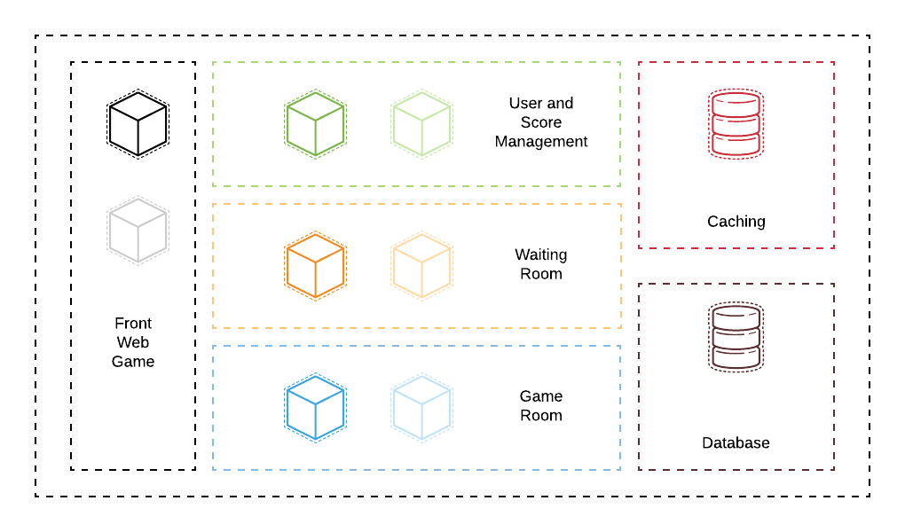

# Webinar - Starting with Apps in Openshift

## Backend

Conjunto de servicios que comunican el Front con la capa de datos. Consiste en 3 servicios:

- **User Management:** permite administrar usuarios y su historial. Servicio tipo REST.
- **Waiting Room:** permite gestionar el inicio de un Game Room, espera la llegada de un mínimo de jugadores para generar la sesión y dar inicio al juego. Servicio de tipo Websocket.
- **Game Room:** permite gestionar un Game Room, ya sea crearlo, mantener el estado, pausarlo y terminarlo. Servicio de tipo Websocket.

## Arquitectura



## Definición de I/O por backend

### User Management

Para ver la especificación Open API ejecutar el paso a paso desde la documentación del [servicio](./user-management/README.md).

### Waiting Room

#### Join to game

Descripción: TODO.

Input:

```json
{
  "method": "",
  "token": "1i2uy2u4y23iu4y",
  "client_version": 1
}
```

Output:

```json
{
  "state": "activated"
}
```

#### Game Room Assign

Descripción: TODO.

Output:

```json
{
  "state": "started",
  "game_room_token": "1i2uy2u4y23iu4y"
}
```

### Game Room

#### Join to room

Descripción: TODO.

Input:

```json
{
  "method": "",
  "token": "1i2uy2u4y23iu4y",
  "game_room_token": "1i2uy2u4y23iu4y",
  "client_version": 1
}
```

Output:

```json
{
  "state": "activated"
}
```

#### Stage

Descripción: TODO.

Output:

```json
{
  "method": "",
  "timestamp": 15639034985098,
  "players": [
    {
      "nickname": "username",
      "pos_x": 123.5,
      "pos_y": -71.1,
      "shape": "monster"
    }
  ]
}
```

#### KeyStroke

Descripción: TODO.

Input:

```json
{
  "method": "",
  "token": "",
  "game_room_token": "",
  "keycode": "",
  "client_version": 1
}
```
